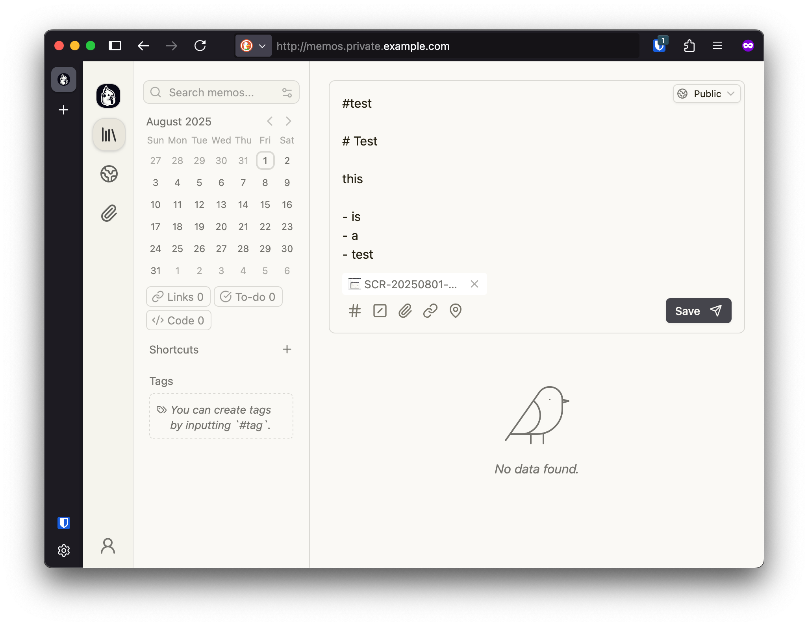
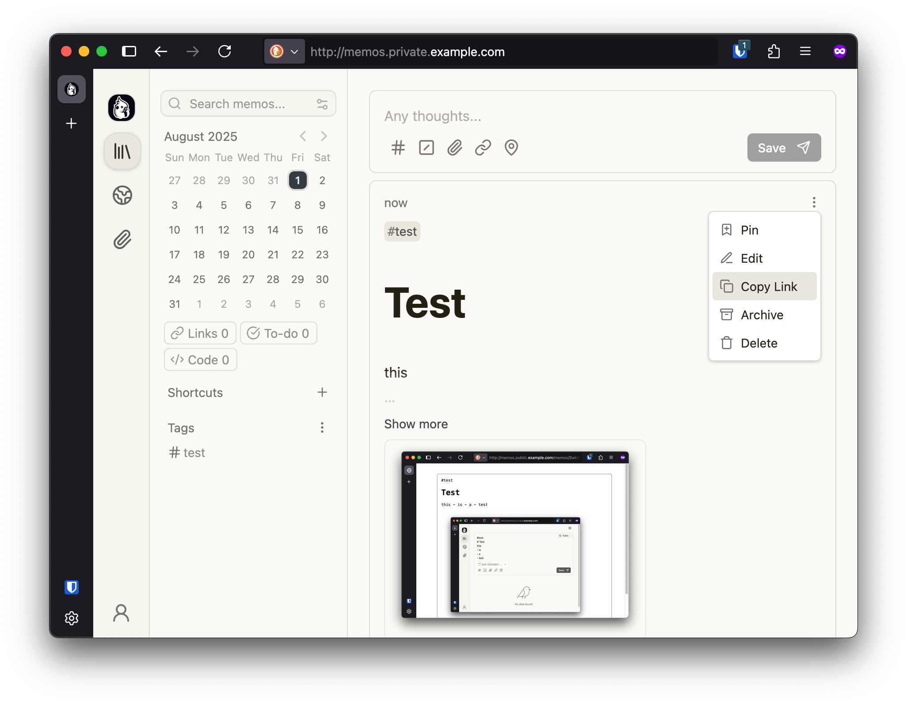
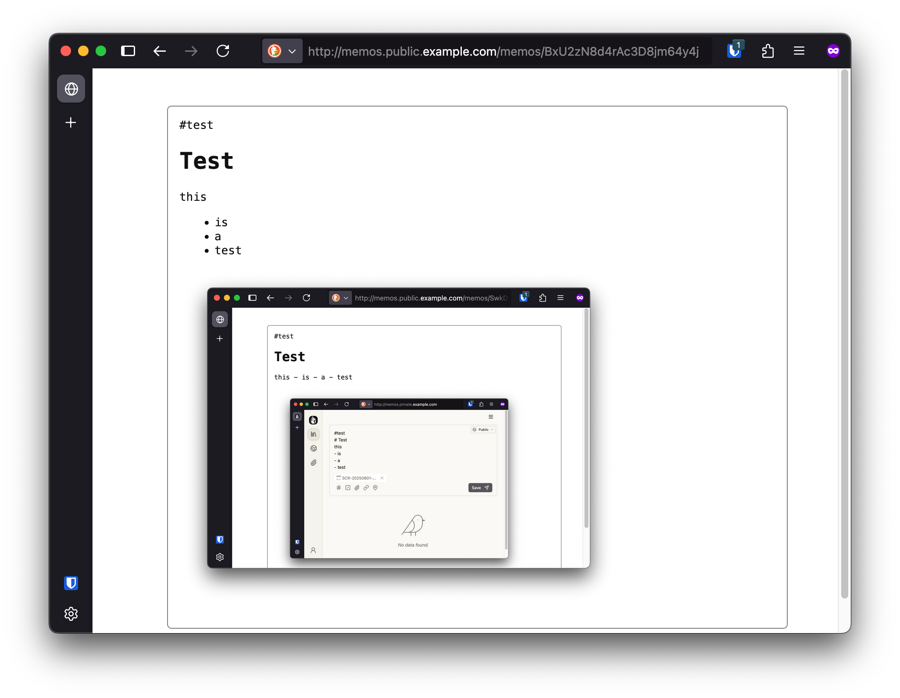

# Memos Public Proxy

Share your public [memos](https://github.com/usememos/memos) in a safe way without exposing your memos instance to the public (inspired by [immich-public-proxy](https://github.com/alangrainger/immich-public-proxy)).

> TODO: A live demo

# Content

* [About](#about)
* [Usage](#usage)
* [Installation](#installation)
  * [Settings](#settings)
  * [Example Docker Compose](#example-docker-compose-file)
  * [Example Caddy Config](#example-caddy-config)
* [Dev Notes](#dev-notes)


# About

I was inspired by the approach taken by immich-public-proxy and I wanted something similar for memos. The memos app already has a concept of public and private visibility, and memos by default are identified by long random strings. What memos-public-proxy does is provide a locked down route for the public to access those public memos without exposing the rest of the memos instance (auth, api, etc..).

# Usage

## Create a public memo



## Copy the link



## Share it



# Installation

## Settings

| Variable | Description | Default |
| - | - | - |
| `MEMOS_LOG_LEVEL` | Log level for the proxy application and for the Gunicorn server. Uses [Gunicorn levels](https://docs.gunicorn.org/en/stable/settings.html#loglevel). | `error` |
| `MEMOS_HOST` | The scheme and authority part of the URL for the Memos server instance. | http://memos:5230 |

# Example Docker Compose File

```yaml
services:

  # Memos instance
  memos:
    image: neosmemo/memos:canary
    restart: unless-stopped
    depends_on:
      - db
    ports:
      - 127.0.0.1:5230:5230
    environment:
      MEMOS_DRIVER: postgres
      MEMOS_DSN: "user=memos password=secret dbname=memosdb host=db sslmode=disable"
      # The Memos variable `MEMOS_INSTANCE_URL` doesn't do anything in the latest release (0.25.0 as of this writing) which is why I'm using the canary tag. See the note below.
      MEMOS_INSTANCE_URL: <your public Memos url>
    volumes:
      - ./server-data:/var/opt/memos

  db:
    image: postgres:16.1
    restart: unless-stopped
    volumes:
      - ./database:/var/lib/postgresql/data/
    environment:
      POSTGRES_USER: memos
      POSTGRES_PASSWORD: secret
      POSTGRES_DB: memosdb

  memos_public_proxy:
    image: ghcr.io/clnhlzmn/memos-public-proxy:main
    restart: unless-stopped
    environment:
      # MEMOS_HOST: http://memos:5230 # Not necessary, the default works in this example.
      MEMOS_LOG_LEVEL: info
    ports:
      - 127.0.0.1:8467:5000
```

## Example Caddy Config

```yaml
*.private.example.com {
    @denied not remote_ip private_ranges
    abort @denied

    # The following proxies memos.private.example.com to the memos server (accessible from local IPs only).
    @memos host memos.private.example.com
    reverse_proxy @memos 127.0.0.1:5230
}

*.public.example.com {
    # The following proxies memos.public.example.com to the memos-public-proxy server (accessible from any IP).
    @memos host memos.public.example.com
    reverse_proxy @memos 127.0.0.1:8467
}
```

> Note: [This PR](https://github.com/usememos/memos/pull/4930) adds support for using the `MEMOS_INSTANCE_URL` when copying a memo link using the "Copy Link" button. What does this mean? You can visit your Memos instance at memos.private.example.com, create a public memo, click "Copy Link", and have a ready-to-share public link of the form `memos.public.example.com/memos/<memo id>`.

# Dev Notes

## Building

`docker build -t memos-public-proxy .`

## Running locally

`docker run --rm --network host -e MEMOS_HOST=<memos host> -e MEMOS_PORT=80 memos-public-proxy`
